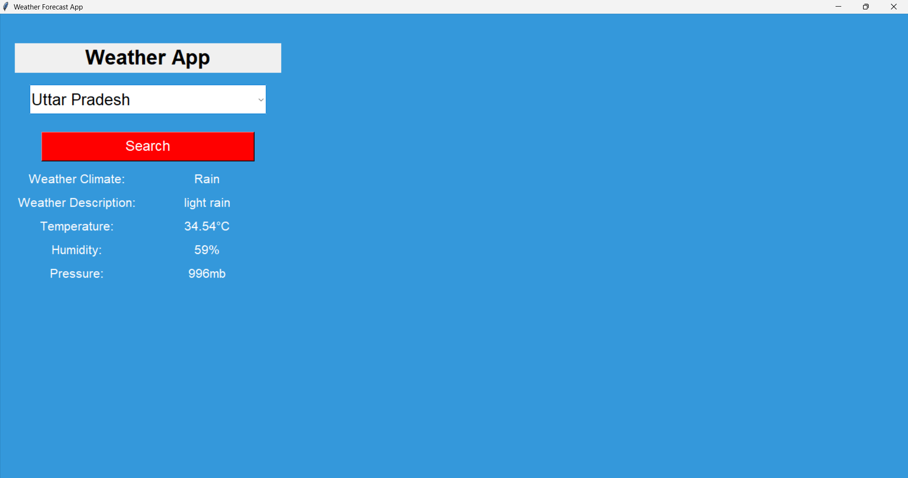

# 🌦️ Tkinter Weather Forecast App



## 📖 Overview

This **Weather Forecast App** is a simple Python GUI application that provides **real-time weather updates** based on user-selected Indian locations. It uses the **OpenWeatherMap API** to fetch data and displays it in a clean and interactive interface built with **Tkinter**.

---

## ✨ Features

- 🎨 User-friendly Tkinter GUI
- 🌐 Real-time weather data using OpenWeatherMap API
- 📊 Displays:
  - Weather climate
  - Description
  - Temperature (in °C)
  - Humidity (%)
  - Atmospheric pressure (mb)
- 🔎 "Search" button to fetch weather info

---

## 🚀 Getting Started

### 1. Clone this Repository
```bash
git clone https://github.com/Shubham0x1/tkinter-weather-app.git
cd tkinter-weather-app
## Install the Required Packages
pip install -r requirements.txt
